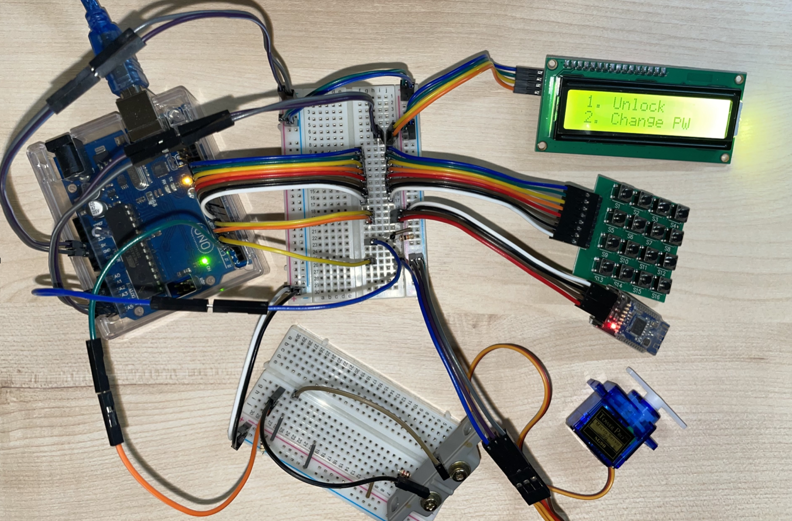

# 아두이노 도어락

> 2021년 2학기 오픈소스 하드웨어 텀프로젝트
> <br><br>아두이노를 활용한 블루투스 도어락 프로젝트

<br>

**목차**
- [아두이노 도어락](#아두이노-도어락)
  - [구성](#구성)
  - [doorlock.ino](#doorlockino)
    - [Libraries](#libraries)
    - [전역변수](#전역변수)
    - [상수 및 기타 변수](#상수-및-기타-변수)
    - [함수](#함수)
      - [`void PrintMenu()`](#void-printmenu)
      - [`void clearInput()`](#void-clearinput)
      - [`bool checkPw()`](#bool-checkpw)
    - [`setup()`](#setup)
    - [`loop()`](#loop)
  - [안드로이드 애플리케이션](#안드로이드-애플리케이션)

---

## 구성
아래 부품이 한개씩 필요하며, 각각 해당하는 핀에 연결하여 회로를 구성합니다.
>  * 아두이노 우노
>  * I2C LCD
>> * SDA: A4
>> * SCL: A5
>  * HM-10 블루투스 모듈
>> * TX: 5
>> * RX: 4
>  * 4x4(or 3x4) Keypad
>> * row: 13, 12, 11, 10
>> * col: 9, 8, 7, 6
>  * NTC Thermister
>> * A2
>  * 마그네틱 도어 센서
>> * 2
>  * 서보 모터
>> * 3
>  * 220Ω 저항
>  * 10KΩ 저항

---

## doorlock.ino
### Libraries

<details>
<summary>코드 보기</summary>

```c++
#include <SoftwareSerial.h>
#include <LiquidCrystal_I2C.h>
#include <Wire.h>
#include <Servo.h>
#include <Keypad.h>
```

</details>

* I2C LCD 디스플레이를 사용하기 위해 [LiquidCrystal_I2C](https://github.com/johnrickman/LiquidCrystal_I2C) 라이브러리를 포함해야 합니다.
* 간단하게 4x4(or 3x4) 키패드를 사용하기 위해 [Keypad](https://playground.arduino.cc/Code/Keypad/) 라이브러리를 추가합니다.


### 전역변수

<details>
<summary>코드 보기</summary>

```c++
char password[6] = {'0', '0', '0', '0', '0', '0'};
char input[6] = {'n', 'n', 'n', 'n', 'n', 'n'};
byte inputCursor = 0;

byte mode = 0;
bool locked = false;
bool pwChecked = false;
```

</details>

* `char password[]`: 도어락의 비밀번호를 저장하기 위한 변수
  * 초기 비밀번호는 `000000`
* `char input[]`: 사용자의 입력을 저장하기 위한 변수
  * 빈 입력을 표시하기 위해 'n' 사용
* `byte inputCursor`: 사용자의 입력 위치를 저장하기 위한 변수
* `byte mode`: 도어락의 모드를 저장하기 위한 변수
  * 0: 메인 메뉴
  * 1: 잠금 해제 모드
  * 2: 비밀번호 변경 모드
* `bool locked`: 현재 잠금 상태를 저장하기 위한 변수
* `bool pwChecked`: 비밀번호 변경 등 비밀번호 확인이 필요한 메뉴에서 인증이 되었는지 여부를 판별하기 위한 변수


### 상수 및 기타 변수

<details>
<summary>코드 보기</summary>

```c++
const int THERMAL_LIMIT = 500; // 화재 인식 범위

const byte KEY_ROWS = 4; // 키패드 열
const byte KEY_COLS = 4; // 키패드 행
// 키패드 배열
const char KEYS[KEY_ROWS][KEY_COLS] = {
  {'1', '2', '3', 'u'},
  {'4', '5', '6', 'd'},
  {'7', '8', '9', 'o'},
  {'*', '0', '#', 'x'}
};

// 핀 위치
const byte PIN_TEMPERATURE = A2;
const byte PIN_DOOR_SENSOR = 2;
const byte PIN_BT_RX = 4;
const byte PIN_BT_TX = 5;
const byte PIN_SERVO = 3;
const byte PIN_KEY_ROWS[KEY_ROWS] = {13, 12, 11, 10};
const byte PIN_KEY_COLS[KEY_COLS] = {9, 8, 7, 6};

// I2C LCD 모듈 
LiquidCrystal_I2C lcd(0x27, 16, 2);
// 블루투스 모듈
SoftwareSerial bt(PIN_BT_TX, PIN_BT_RX);
// 키패드
Keypad pad = Keypad(makeKeymap(KEYS),
                    PIN_KEY_ROWS, PIN_KEY_COLS,
                    KEY_ROWS, KEY_COLS);
// 서보모터
Servo servo;
```

</details>


### 함수
```c++
void printMenu();
void clearInput();
bool checkPw();
```

#### `void PrintMenu()`

<details>
<summary>코드 보기</summary>

```c++
void printMenu() {
  lcd.init();
  switch (mode) {
    case 0: // Main menu mode
      lcd.setCursor(1, 0);
      lcd.print("1. Unlock");
      lcd.setCursor(1, 1);
      lcd.print("2. Change PW");
      break;

    case 1: // Unlock mode
      lcd.setCursor(4, 0);
      lcd.print("Password");
      break;

    case 2: // Settings mode
      if (pwChecked) {
        lcd.setCursor(2, 0);
        lcd.print("Enter new pw");
      } else {
        lcd.setCursor(4, 0);
        lcd.print("Enter pw");
      }
      break;

  }
}
```

</details>

* 전역 변수 `mode`에 따라 I2C LCD에 화면을 출력합니다.
* `mode 0`: 메인 메뉴로, 1번을 눌러 잠금 해제하거나 2번을 눌러 비밀번호를 변경할 수 있습니다.
* `mode 1`: 설정된 비밀번호를 입력하면 잠금 해제합니다.
* `mode 2`: 전역 변수 `pwChecked`에 따라 비밀번호 확인 절차를 거치고 새 비밀번호를 입력하도록 안내합니다.

#### `void clearInput()`

<details>
<summary>코드 보기</summary>

```c++
void clearInput() {
  for (int i = 0; i < 6; i++) {
    input[i] = 'n';
  }
  inputCursor = 0;
}
```

</details>

* 사용자의 입력은 전역변수 `input`에 저장됩니다.
* 입력이 완료되었거나 취소되면 이 함수에 의해 `input` 변수에 저장된 값이 'n'으로 초기화됩니다.

#### `bool checkPw()`

<details>
<summary>코드 보기</summary>

```c++
bool checkPw() {
  bool correct = true;
  for (int i = 0; i < 6; i++) {
    if (password[i] != input[i]) {
      correct = false;
      break;
    }
  }

  return correct;
}
```

</details>

* 사용자의 입력 `input`과 설정된 비밀번호 `password`를 비교하여 비밀번호가 일치하는지 확인합니다.


### `setup()`

<details>
<summary>코드 보기</summary>

```c++
void setup() {
  // put your setup code here, to run once:

  Serial.begin(9600);

  // Initialize servo
  servo.attach(PIN_SERVO);
  servo.write(0);

  // Initiailize bluetooth
  bt.begin(9600);

  // Initialize button (proximity replacement)
  pinMode(PIN_DOOR_SENSOR, INPUT);

  lcd.init();
  lcd.backlight();
  lcd.setCursor(3, 0);
  lcd.print("PW: 000000");
  lcd.setCursor(0, 1);
  lcd.print("Press any button");

  char key;
  while (!(key = pad.getKey())) {
    delay(100);
  }

  printMenu();

}
```

</details>

* `setup()` 함수는 처음 한 번만 실행됩니다.
* 각 센서와 액추에이터 핀을 설정하고 초기화합니다.
* 초기 비밀번호를 사용자에게 고지합니다.
* 사용자의 입력을 대기하고, 아무 키나 눌리면 `loop()` 함수로 진행할 수 있도록 합니다.


### `loop()` 

```c++
void loop() {
  // put your main code here, to run repeatedly:

  // 화재 감지
  ...

  // 문 닫힘 감지
  ...

  // 블루투스 인식
  ...

  // 키 입력
  ...

  // 입력된 키에 따라 기능 수행

  delay(50);
}
```

* `loop()` 함수는 위와 같은 구성으로 이루어져 있습니다.
* 아래 코드 보기를 클릭하여 자세한 설명을 확인할 수 있습니다.

<details>
<summary>코드 보기</summary>

```c++
// 화재 감지
  int temp = analogRead(PIN_TEMPERATURE);
  if (temp > THERMAL_LIMIT) {
    locked = false;
    servo.write(0);

    delay(5000);
    return;
  }
```

* NTC Thermister에서 현재 온도를 측정하여 상수로 선언되어 있는 `THERMAL_LIMIT`의 값보다 높다면 이후의 코드를 모두 무시하고 잠금이 해제됩니다.

```c++
  // 문 닫힘 감지
  if (!digitalRead(PIN_DOOR_SENSOR) && !locked) {
    locked = true;
    servo.write(90);

    lcd.init();
    lcd.setCursor(5, 0);
    lcd.print("Locked");

    delay(1000);
    printMenu();
  }
```

* 문이 열려 있는 상태에서 마그네틱 도어 센서가 인식되면 서보모터를 동작시켜 문을 닫습니다.

```c++
  // 블루투스 인식
  if (bt.available()) {
    byte data = bt.read();
    if (data == 'u') {
      bool pass = true;
      for (int i = 0; bt.available() && i < 6; i++) {
        if (bt.read() != password[i]) {
          pass = false;
          break;
        }
      }

      if (pass) {
        servo.write(0);

        lcd.init();
        lcd.setCursor(3, 0);
        lcd.print("Bluetooth");
        lcd.setCursor(4, 1);
        lcd.print("Unlocked");

        delay(3000);
        printMenu();

      }

    } else if (data == 'l') {
      servo.write(90);

      lcd.init();
      lcd.setCursor(3, 0);
      lcd.print("Bluetooth");
      lcd.setCursor(5, 1);
      lcd.print("Locked");

      delay(1000);
      printMenu();
    }
  }
```

* 블루투스 장비로부터 수신된 메시지에 따라 동작을 수행합니다.
* `l` 명령어가 입력되면 서보모터를 90° 회전시켜 문을 잠급니다.
* `u` 명령어가 입력되면 이후 따라오는 6자리 PIN을 설정된 비밀번호와 비교하여 일치하면 잠금을 해제합니다.
  * `u012345` 가 입력된 경우, `u` 는 명령어로, `012345`는 비밀번호로 인식합니다.

```c++
char key = pad.getKey();

if (!key) {
  delay(50);
  return;
}
```

* 키패드에서 입력된 키를 저장하고, 만약 입력된 키가 없다면 `loop()` 함수로 리턴합니다.

```c++
switch (mode) {
  case 0: // Main menu mode
    ...
    break;

  case 1: // Unlock mode
    ...
    break;

  case 2: // Settings mode
    ...
    break;
}
```

* 전역 변수 `mode`에 저장된 값에 따라 다른 기능을 수행합니다.

```c++
case 0: // Main menu mode
  if (key == '1') {
      mode = 1;
      printMenu();
    } else if (key == '2') {
      mode = 2;
      printMenu();
    }
    break;
```

* 메인 메뉴에서는 입력된 키의 값에 따라 전역 변수 `mode`를 설정하고, 화면을 출력합니다.

```c++
case 1: // Unlock mode
    input[inputCursor++] = key;
    lcd.setCursor(4 + inputCursor, 1);
    lcd.print(key);

    if (inputCursor >= 6) {
      if (checkPw()) {

        locked = false;
        servo.write(0);

        lcd.init();
        lcd.setCursor(4, 0);
        lcd.print("Welcome!");
        lcd.setCursor(4, 1);
        lcd.print("Unlocked");

        delay(3000);

      } else {

        lcd.init();
        lcd.setCursor(5, 0);
        lcd.print("Wrong");
        lcd.setCursor(4, 1);
        lcd.print("Password");

        delay(1000);
      }

      // Clear input
      clearInput();
      mode = 0;
      printMenu();

    }
    break;
```

* 잠금 해제 모드에서는 사용자가 입력한 키를 전역 변수 `input`에 저장하고, 6자리가 모두 입력되었다면 설정된 비밀번호와 비교하여 잠금을 해제합니다.
  * 여기에서 사용자가 입력한 `input` 위치를 판별하는데 `inputCursor` 전역 변수가 사용됩니다.
  * 비밀번호가 올바른지, 틀린지에 따라 화면에 메시지를 출력합니다.


```c++
case 2: // Settings mode
    input[inputCursor++] = key;
    lcd.setCursor(4 + inputCursor, 1);
    lcd.print(key);

    if (inputCursor >= 6) {
      if (pwChecked) {
        pwChecked = false;

        for (int i = 0; i < 6; i++) {
          password[i] = input[i];
        }

        lcd.init();
        lcd.setCursor(4, 0);
        lcd.print("Password");
        lcd.setCursor(4, 1);
        lcd.print("Changed!");

        delay(1000);

        mode = 0;
        printMenu();

      } else {
        if (checkPw()) {
          pwChecked = true;
          printMenu();
        } else {
          pwChecked = false;

          lcd.init();
          lcd.setCursor(5, 0);
          lcd.print("Wrong");
          lcd.setCursor(4, 1);
          lcd.print("Password");

          delay(1000);

          mode = 0;
          printMenu();
        }
      }
      clearInput();
    }
    break;
```

* 잠금 해제 모드와 비슷한 동작을 수행합니다.
* 단, 비밀번호 변경 모드에서는 1차로 비밀번호를 확인한 후에 잠금을 해제하는 대신 새 비밀번호를 입력받도록 합니다.
* 새 비밀번호가 모두 입력되면 이를 전역 변수 `password`에 저장하여 비밀번호를 변경합니다.

</details>


---

## 안드로이드 애플리케이션
* 안드로이드 애플리케이션의 코드는 [android](/android/)에서 확인하실 수 있습니다.
* 안드로이드 앱은 HM-10 모듈과 블루투스 4.0 BLE로 통신하며, 이를 위해 Bluetooth Gatt을 사용합니다.
* 안드로이드 앱은 Kotlin으로 작성되어 있습니다.
